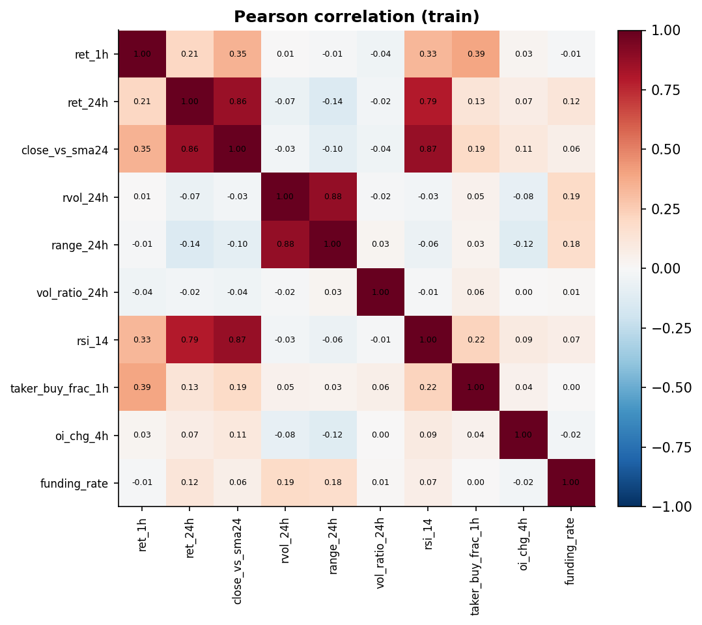
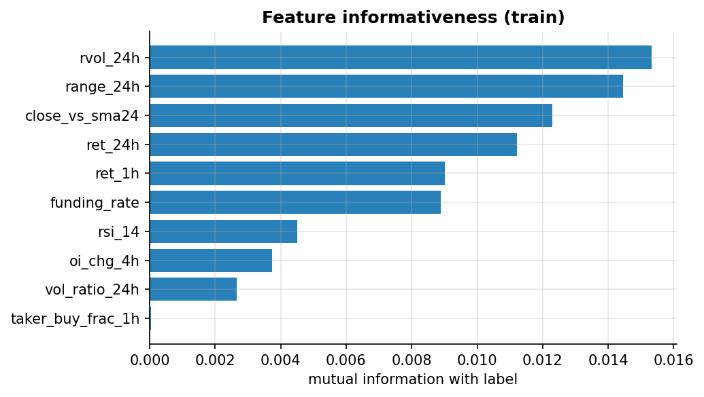
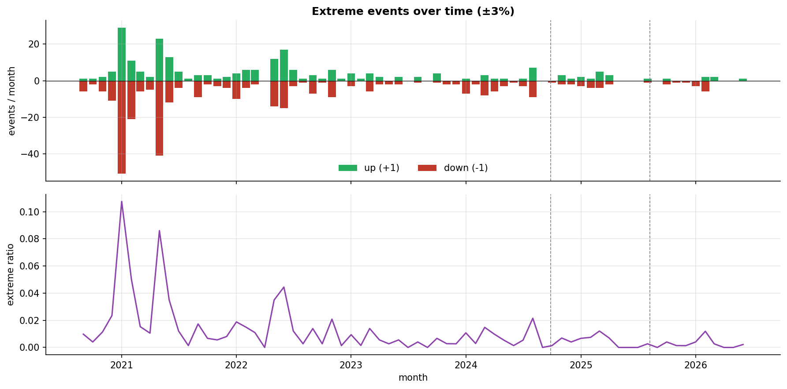
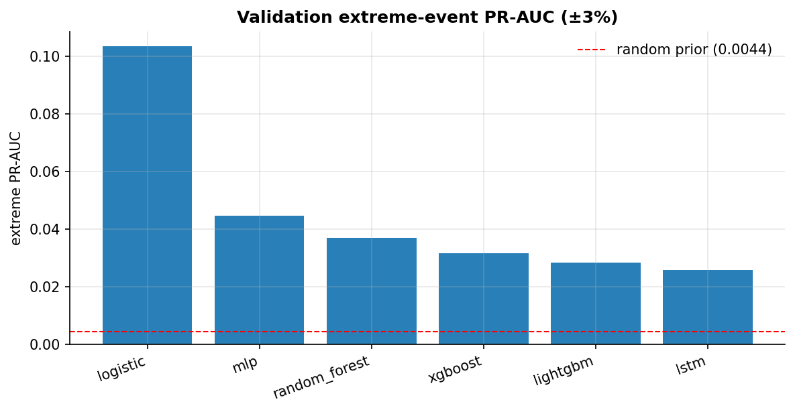
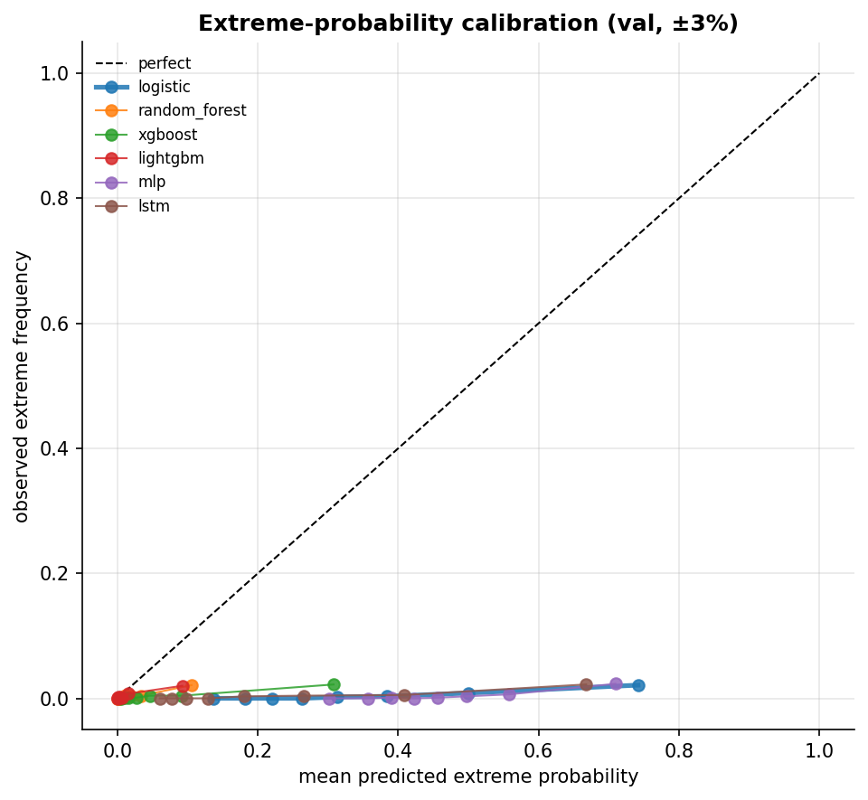
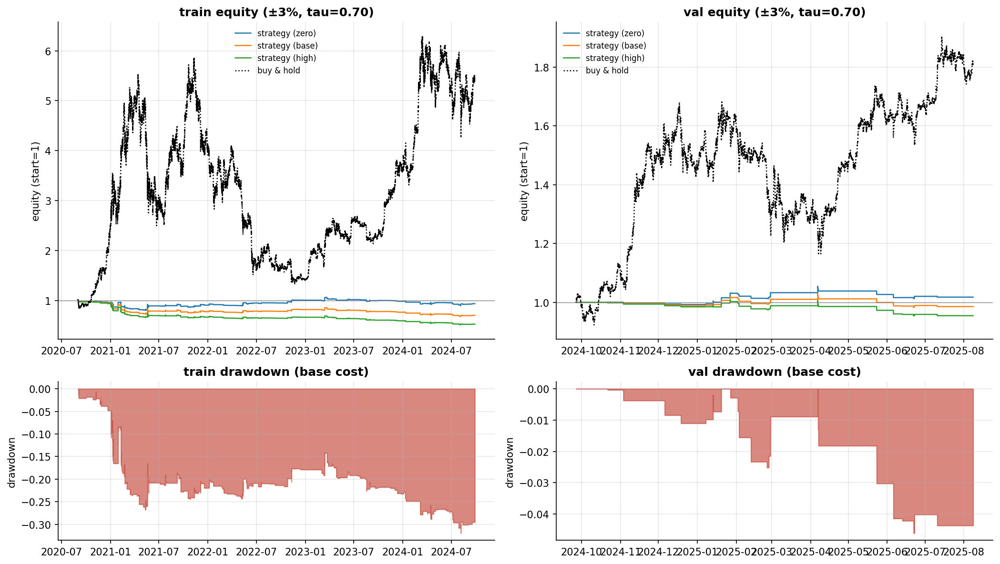
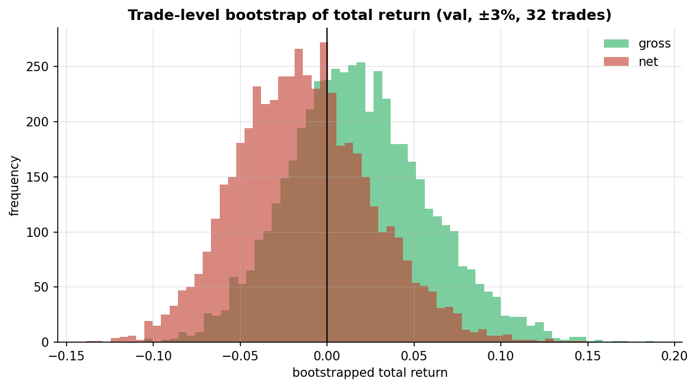
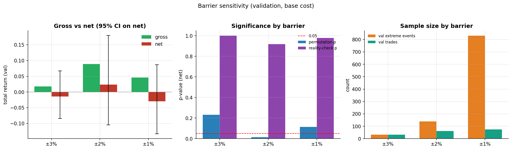
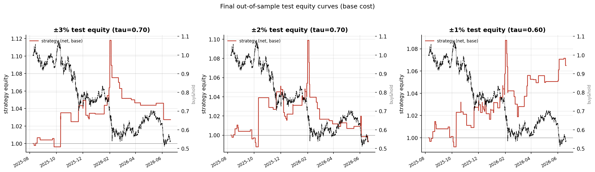

# Hourly Extreme-Movement Prediction and Trading Validation on BTC

**APS1052 course project — final report**

> **Research question.** Can interpretable market, sentiment, and leverage
> features observed at hourly decision points predict which price barrier (±θ)
> will be reached first during the following hour, and can such predictions
> generate statistically and economically meaningful trading performance after
> transaction costs?

**One-line answer.** There is a *weak but real* predictive signal — extreme-event
PR-AUC well above the random prior, and out-of-sample permutation tests are
significant at the ±1% and ±3% barriers — but it does **not** amount to
data-snooping-robust, cost-covering economic value: White's Reality Check is not
rejected and every net-return confidence interval includes zero.

---

## 1. Problem and framing

At each hourly timestamp *t* (UTC) we use only information available at *t* to
predict the price path over the next hour (t, t+1h], as a three-class label:

- **+1** — the upper barrier `close_t·(1+θ)` is touched first;
- **−1** — the lower barrier `close_t·(1−θ)` is touched first;
- **0** — neither barrier is touched within the hour.

Decisions are hourly (non-overlapping forward windows); the path is judged on
1-minute bars (first-touch). The main barrier is **θ = 3%**, with **θ ∈ {1%, 2%}**
as pre-registered sensitivity. The project consumes a **frozen** dataset and runs
the chain *data → supervised learning → trading signals → backtest → statistical
validation*.

## 2. Data

- **50,522** hourly observations, **2020-09-01 → 2026-06-20**, no missing values.
- **10 interpretable features** across five dimensions (price/trend, volatility,
  volume, sentiment/order-flow, leverage/derivatives). See
  [data dictionary](../outputs/tables/data_dictionary.csv).
- Sources: Binance spot 1-minute klines (hourly bars + intra-hour path), futures
  open-interest (5-minute), funding rate (8-hour), as-of merged with no
  look-ahead.
- **Chronological split 70/15/15** (no shuffling): train 2020-09→2024-09
  (35,365), validation →2025-08 (7,578), test →2026-06 (7,579).

## 3. Data-integrity audit (Stage 1)

All checks pass — see [STAGE1_AUDIT](../outputs/audit/STAGE1_AUDIT.md):

- **Timestamps**: monotone, unique, all on the hour, 99.39% hourly coverage (gaps
  are dropped exchange-outage hours and incomplete forward windows, by design).
- **Missing values**: 0 across every feature and split.
- **Label integrity**: 0 violations; the documented same-minute double-touch cases
  are correctly identified as legitimate label-0 (2 at ±2%, 3 at ±1%).

## 4. Labels and features

- **First-touch triple-barrier** label encodes direction, magnitude, path
  ordering, and a fixed horizon simultaneously (see project docs).
- The 10 features are deliberately plain (each explainable in one sentence) and
  strictly causal (only data ≤ t). Leakage prevention: rolling windows look
  backward only; funding/OI use real release times via backward as-of merges;
  scalers are fit on train only.

## 5. Exploratory analysis (Stage 1b)

See [STAGE1B_EDA](../outputs/eda/STAGE1B_EDA.md).

- **Redundancy**: highest pairwise correlation 0.882 (`range_24h`↔`rvol_24h`),
  max VIF 6.58 — moderate, within-dimension multicollinearity (a volatility
  cluster and a trend/stretch cluster), all VIF < 10. No feature is dropped; each
  keeps a distinct one-sentence meaning. 
- **Informativeness**: volatility features (`rvol_24h`, `range_24h`) carry the most
  mutual information with the label — the task is fundamentally a volatility
  problem. 
- **Non-stationarity (the central challenge)**: extreme events cluster heavily in
  2021 (monthly extreme ratio up to 10.75%) and decay sharply as BTC matures; the
  validation/test period (2024-09→) has almost no ±3% events. `funding_rate` shows
  the largest train→test distribution shift (KS = 0.489).
  

## 6. Models (Stage 3) and selection (Stage 4)

Six learning models plus three baselines, all evaluated on validation (test
frozen). Ranked by extreme-event **PR-AUC** — the metric aligned with the goal:

| model | extreme PR-AUC | balanced acc | extreme recall | log loss |
|---|---|---|---|---|
| **logistic** | **0.104** | 0.482 | 0.58 | 0.495 |
| mlp | 0.045 | 0.494 | 0.64 | 0.655 |
| random_forest | 0.037 | 0.333 | 0.00 | 0.043 |
| xgboost | 0.032 | 0.348 | 0.09 | 0.088 |
| lightgbm | 0.028 | 0.333 | 0.00 | 0.036 |
| lstm | 0.026 | 0.457 | 0.52 | 0.329 |

- **The simplest model wins.** Under extreme imbalance + regime shift, multinomial
  logistic regression generalizes best; tree/boosting models overfit the 2021
  high-volatility regime and collapse to near-random PR-AUC out of sample. (Their
  *lower* log loss is misleading — they confidently predict the 99.6%-majority
  flat class; that is why PR-AUC, not log loss, drives selection.)
- **Selected model: `logistic`** (best PR-AUC, strong recall, fully interpretable).
- **Calibration**: class balancing makes every model over-confident — predicted
  extreme probabilities reach 0.7 while observed extreme frequency stays ~0.02.
  Raw probabilities cannot be read as literal probabilities, so the trading
  threshold is calibrated empirically on validation.
  

## 7. Trading signals (Stage 5) and backtest (Stage 6)

- **Signal**: `+1` if P(+1) ≥ τ, `−1` if P(−1) ≥ τ, else flat. τ swept on validation
  trading performance and **frozen at τ = 0.70** for ±3%.
- **Execution (barrier-aligned)**: enter at the **next-minute open**, TP = SL =
  barrier, max hold 1 hour, first-touch on the 1-minute path, at most one position
  per hour. The 1-minute path table reproduces the stored labels with **100%
  agreement**, validating the timestamp alignment.
- **Costs**: Binance USDT-M perpetual, per-side (fee + slippage) — zero / **base
  0.05%** / high 0.10%.

**Validation, ±3%, base cost**: 32 trades, gross **+1.79%**, net **−1.41%**,
Sharpe −0.37. The gross edge is real but small; realistic costs eliminate it.

## 8. Statistical validation (Stage 7, validation, ±3%)

See [STAGE7_STATS](../outputs/stats/STAGE7_STATS.md). Gross and net reported
throughout; only 32 trades, so intervals are wide by construction.

| test | net | gross |
|---|---|---|
| total-return 95% CI (trade bootstrap) | −1.41% [−8.45%, +6.74%] | +1.79% [−5.39%, +10.14%] |
| stationary-bootstrap CI (block 24h) | −1.35% [−7.82%, +5.50%] | +1.85% [−4.87%, +9.24%] |
| circular-shift permutation p | 0.232 | 0.232 |
| White's Reality Check p (6×4 candidates) | 1.000 | 0.495 |

Both CIs include zero; the permutation test does not reject; after correcting for
the candidate search, the reality check finds no strategy that beats always-flat.

## 9. Barrier sensitivity (Stage 7b, pre-registered)

Same isomorphic chain per barrier (re-label → re-train → re-calibrate τ →
backtest → test). Validation, base cost:

| barrier | val events | PR-AUC | τ | trades | gross | net | net 95% CI | Sharpe | perm p | RC p |
|---|---|---|---|---|---|---|---|---|---|---|
| ±3% | 33 | 0.104 | 0.70 | 32 | +1.79% | −1.41% | [−8.4%, +6.7%] | −0.37 | 0.232 | 1.000 |
| ±2% | 139 | 0.115 | 0.70 | 62 | +8.91% | **+2.36%** | [−10.4%, +17.9%] | +0.39 | **0.015** | 0.919 |
| ±1% | 830 | **0.367** | 0.60 | 75 | +4.63% | −2.93% | [−13.3%, +8.7%] | −0.53 | 0.114 | 0.979 |

- **±1% has the best classification** (PR-AUC 0.367) — the model predicts small
  moves far better — yet trades unprofitably because small barriers yield thin
  per-trade profit that costs erode.
- **±2% is the economic sweet spot** (net +2.36%, Sharpe +0.39, permutation
  p = 0.015) — but **fails the reality check** (p = 0.92): a single significant
  permutation test does not survive multiple-testing correction. *This gap is the
  entire point of the reality check.*
- Every barrier: gross positive, none data-snooping-robust, all net CIs cross zero.

## 10. Final out-of-sample test (Stage 8)

Test set unsealed once per barrier; everything frozen (logistic, per-barrier τ,
next-minute open, base cost). See [STAGE8_FINAL_TEST](../outputs/backtest/STAGE8_FINAL_TEST.md).

| barrier | test events | PR-AUC | trades | gross | net | net 95% CI | Sharpe | perm p |
|---|---|---|---|---|---|---|---|---|
| **±3% (main)** | 21 | 0.027 | 46 | +7.56% | **+2.73%** | [−9.7%, +17.1%] | +0.47 | **0.017** |
| ±2% | 105 | 0.088 | 67 | +6.19% | −0.69% | [−13.2%, +13.5%] | −0.07 | 0.071 |
| ±1% | 766 | 0.300 | 80 | +15.35% | **+6.49%** | [−5.3%, +19.7%] | **+1.18** | **0.0005** |

- Out-of-sample the strategy is **net-positive at ±3% and ±1%** with significant
  permutation p-values (±1%: p = 0.0005), so the signal-return alignment persists.
- **Context**: the test window (2025-08→2026-06) was a BTC drawdown (buy-and-hold
  fell ~45%); the short-biased extreme strategy stayed positive.
- **But**: every net-return CI still includes zero, and validation's reality check
  already showed the family is not data-snooping-robust. Encouraging, not
  conclusive.

## 11. Limitations

1. **Sample size at the tails** — 21–105 extreme test events at ±2%/±3%; single-
   point metrics and even bootstrap CIs are noisy. Wide intervals are a result.
2. **Regime shift** — models train on a high-volatility era and predict a low-
   volatility one; ±3% events are near-absent late in the sample.
3. **Probability miscalibration** — class balancing inflates minority
   probabilities; τ is an operating point, not a probability.
4. **Data-snooping** — six models × four τ × three barriers is a real search;
   White's Reality Check is the honest correction and it is not rejected.
5. **Single asset / venue** — BTC on Binance; costs are assumptions.

## 12. Conclusion

The features carry a **weak, genuine predictive signal** for hourly extreme
moves — extreme PR-AUC well above the random prior, best classification at ±1%,
and out-of-sample permutation significance at ±1% and ±3%. That signal does **not**
establish **tradeable economic value**: after realistic costs the net-return
confidence intervals include zero at every barrier, and once the candidate search
is accounted for (White's Reality Check) no strategy beats a flat benchmark. This
is a complete and rigorous result — it separates *statistical predictability* from
*economic realizability*, and it holds all settings frozen with no result-driven
tuning.

---

### Reproducibility

- Environment: [requirements.txt](../requirements.txt), Python 3.9.10, seed 1052.
- Code: `src/aps/` (library) + `pipelines/s1…s8` (one entry point per stage).
- Run order: `s1_audit → s1b_eda → s2_baselines → s3_models → s4_select →
  s5_signals → s6_backtest → s7_stats → s7b_barrier_sensitivity → s8_final_test`.
- Artifacts: `outputs/{audit,eda,models,backtest,stats,figures,tables}`; per-stage
  Markdown reports; trade ledgers, predictions, equity, and statistical outputs
  as CSV/Parquet.
