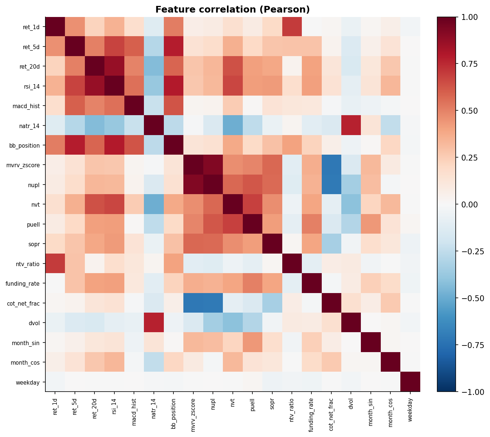
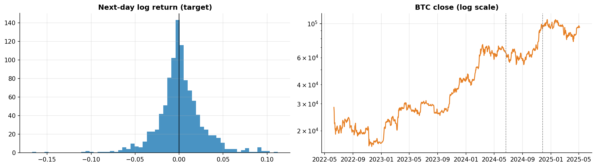
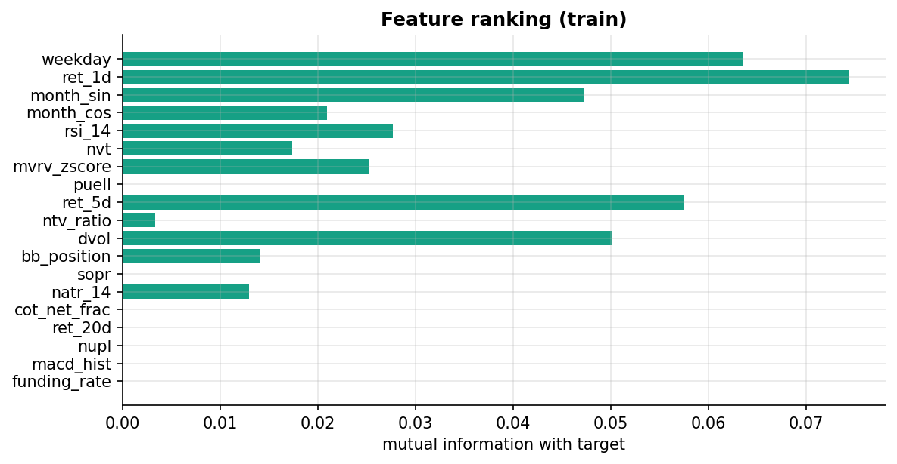
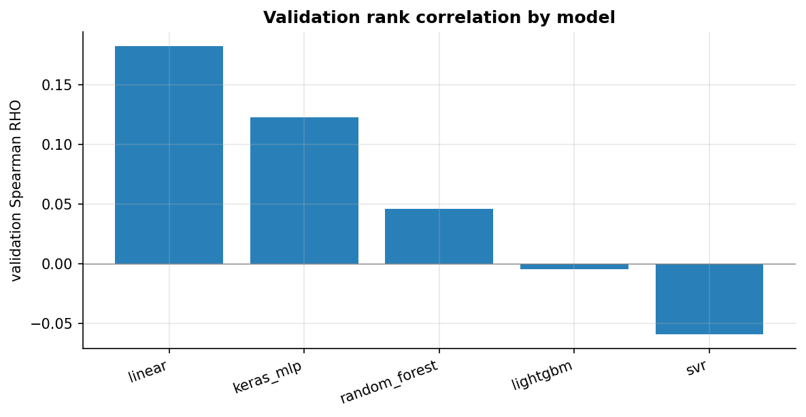
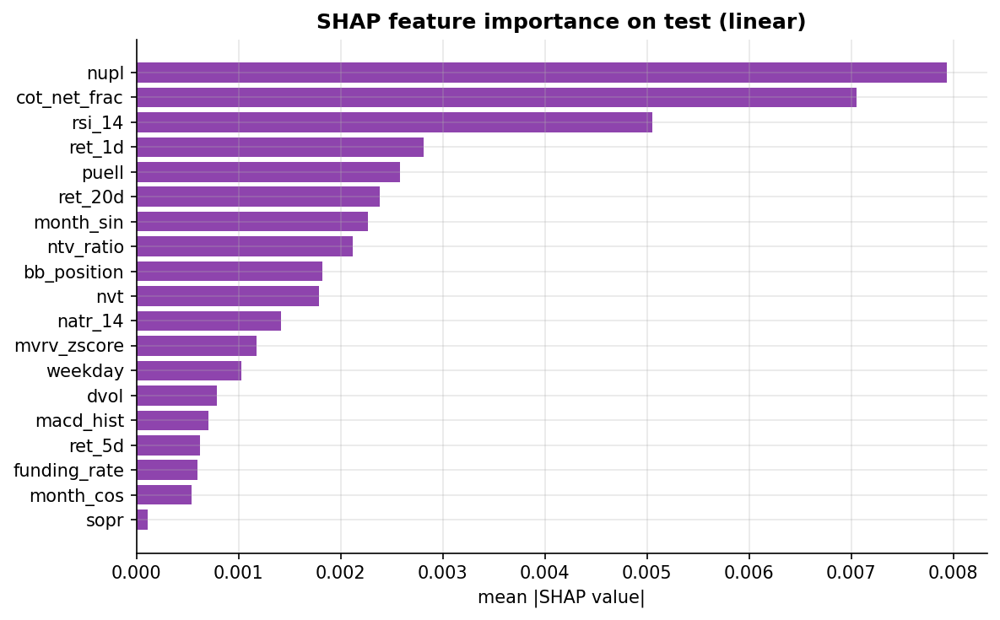
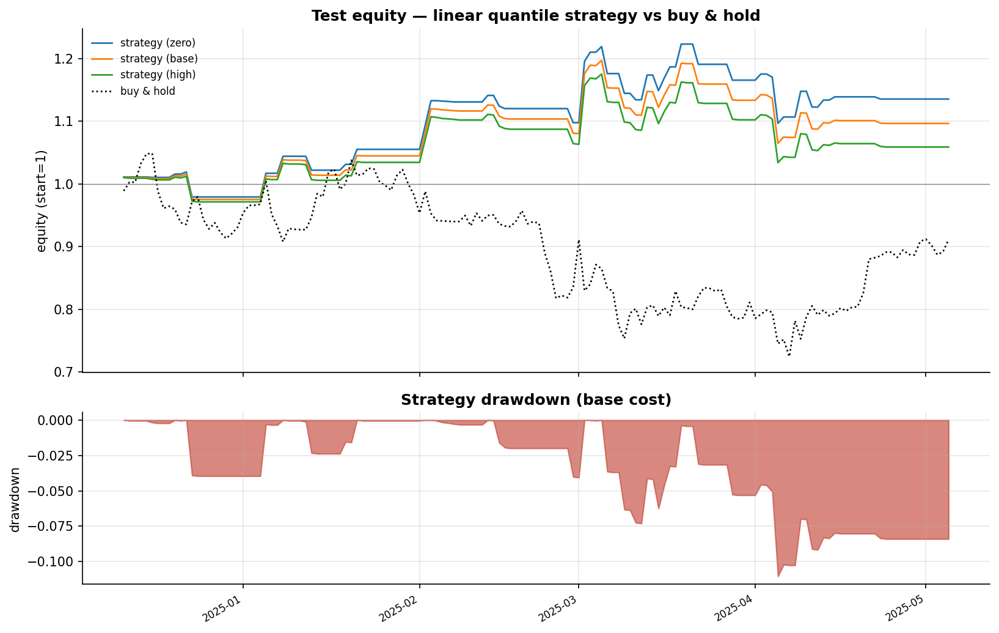

<!-- Render: marp reports/SLIDES.md -o slides.pdf  (VS Code Marp extension shows the speaker notes). Each slide's HTML comment is its presenter note. -->

# Predicting BTC Daily Returns & Quantile Trading

### APS1052 — Final Project

**Target:** next-day log return of Bitcoin (regression, daily).
**5 models** (Scikit-Learn + Keras, no PyTorch) · **19 features** (12 not from the
price bar) · leak-free chronological validation · cost-aware quantile backtest ·
White Reality Check + Monte-Carlo permutation.

<!-- Speaker note: This project predicts the next-day log return of Bitcoin and turns the prediction into a quantile trading strategy. The emphasis is a clean, leak-free pipeline and honest statistical validation, not just a headline return. The data base is a fixed teammate export; we did not add external data. -->

---

## Problem & target

- **Asset:** Bitcoin (a single target). Crypto is chosen because it carries rich
  on-chain indicators beyond the price bar.
- **Quantity predicted:** next-day **log return** `y_{t+1}=log(close_{t+1}/close_t)`.
- **Frequency:** daily (less noisy than intraday; on-chain data is daily).
- **Chain:** data → supervised regression → quantile signals → backtest → stats.

<!-- Speaker note: A single regression target — the next-day log return. Daily frequency is deliberate: it is less noisy than intraday and, crucially, the non-price on-chain indicators are published daily, so daily is the natural resolution. We predict a continuous return, then trade the extreme predicted quantiles. -->

---

## Data base & frequency

- Teammate `raw_data/` export (HELM engine), **read-only, unchanged**.
- Daily OHLCV + pre-computed TA; on-chain metrics; funding; COT; DVOL; net-taker
  volume.
- Common window **2022-06 → 2025-05**, bounded by the on-chain start and DVOL end.
- **1060 trading days**, 100% daily coverage, **0 missing values**.

<!-- Speaker note: The data base is fixed — we consumed the teammate feeds as-is. The usable window is the intersection of all feeds: on-chain metrics begin mid-2022 and DVOL ends mid-2025, giving 1060 clean daily rows with full coverage and no missing values. -->

---

## Feature set — 19 features, 12 NOT from the price bar

| From target OHLCV (7) | Not from target OHLCV (12) |
|---|---|
| ret_1d/5d/20d, rsi_14, | on-chain: mvrv_zscore, nupl, nvt, |
| macd_hist, natr_14, bb_position | puell, sopr; ntv_ratio; funding_rate; |
| | cot_net_frac; dvol; month_sin/cos; weekday |

> The assignment requires ≥15 features with ≥half not based on the target's OHLCV
> bar — here **12 of 19 (63%)** are non-OHLCV.

<!-- Speaker note: The assignment insists on at least fifteen features and at least half from sources other than the target's own price bar. We have nineteen, twelve of them non-OHLCV: five on-chain metrics, net-taker volume, funding, COT positioning, implied volatility, and calendar features. -->

---

## Non-OHLCV features (the majority)

- **On-chain (5):** MVRV Z-score, NUPL, NVT, Puell multiple, SOPR — valuation and
  holder-behavior signals unavailable from price alone.
- **Derivatives / flow:** funding rate, net-taker-volume imbalance, DVOL implied
  volatility.
- **Positioning:** CFTC COT leveraged-money net position (weekly, as-of merged).
- **Calendar:** month (sin/cos), weekday.

<!-- Speaker note: These are the features the assignment specifically praises. On-chain metrics describe network valuation and holder profit/loss; funding and net-taker volume capture derivatives pressure; COT captures institutional positioning; DVOL is the crypto VIX. None of these come from the BTC price bar. -->

---

## OHLCV / TA features (the minority)

- **Returns:** 1-, 5-, 20-day log returns (momentum / trend).
- **TA:** RSI(14), MACD histogram, NATR(14), Bollinger-band position.
- Sourced from the pre-computed `BTCUSDT_OHLCV_TA_plus.csv` (no TA-Lib install).

<!-- Speaker note: Seven features come from the price bar: three horizon returns and four classic technical indicators. We used the teammate's pre-computed TA file, which avoids a fragile TA-Lib build and keeps the feature definitions fixed. -->

---

## Leakage prevention & target alignment

- Features at t use only data ≤ t; the target is **strictly future** (t → t+1).
- Weekly COT is merged **as-of backward** (last report ≤ t).
- Rolling scaling includes the current row ⇒ target shifted so `X_t → y_{t+1}`.
- **Target-alignment check: exact (max error 0.0).**

<!-- Speaker note: Leakage is the number-one risk. Every feature is known at the close of day t; the target is the return realized the next day. Weekly COT uses only the last report available at t. We verified the target equals log(close_{t+1}/close_t) exactly. -->

---

## Audit & EDA — data quality

- 1060 daily rows, **100% coverage**, 0 missing, 0 duplicate dates.
- Feature distributions and correlation structure inspected.
- Moderate within-group correlation (returns cluster; on-chain valuation cluster).

<!-- Speaker note: The dataset is clean: full daily coverage, no missing values. The correlation heatmap shows expected clusters — the horizon returns correlate, and the on-chain valuation metrics correlate — but nothing is redundant enough to drop outright. -->

---

## Target distribution & price

- Next-day log return: mean ≈ +0.11%/day, std ≈ 2.7%, near-symmetric, fat tails.
- Test window (right of dashed lines) is a **falling / choppy** BTC period.

<!-- Speaker note: The target is a noisy, near-symmetric daily return with fat tails — hard to predict in levels, which is why we score models on rank correlation. Note the test period is a BTC drawdown, which will matter when we compare the strategy to buy-and-hold. -->

---

## Chronological split (no shuffle)

| split | rows | period |
|---|---|---|
| train | 679 | 2022-09 → 2024-06 |
| validation | 146 | 2024-06 → 2024-11 |
| test | 146 | 2024-11 → 2025-05 |

- Rolling scaling drops 90 warm-up rows ⇒ common index of 971 rows for **all** models.
- Test is sealed until the single final evaluation.

<!-- Speaker note: A strict time-ordered split. Because rolling scaling needs a 90-day warm-up, we trim those rows for every model so all five share the same rows and the same sealed test set. Roughly 70/15/15. -->

---

## Scaling — three regimes, each in its place

1. **Meaning-preserving** (once): RSI→(x−50)/50, MACD→asinh(MACD/close),
   positive levels→log. Prevents distortion.
2. **Global StandardScaler** — inside the ML grid pipeline (fit on train folds).
3. **Rolling scaling** (`asymmetric_rolling_scale`) — for the Keras MLP, applied to
   the whole matrix before the split (causal).

<!-- Speaker note: Scaling is done the way the assignment prescribes. First, meaning-preserving transforms so price-scale indicators are not destroyed. Then, for the tabular models, a StandardScaler inside the cross-validated pipeline. For the neural net, the provided rolling-scale function, which is causal and applied before splitting. -->

---

## Feature selection

- `SelectKBest` with `f_regression` (linear) / mutual information (non-linear),
  **inside** the CV pipeline; `k` is tuned per model.
- Ranking on train identifies the **two weakest** features (first to discard).
- On-chain NUPL / MVRV and COT rank among the strongest.

<!-- Speaker note: Feature selection lives inside cross-validation via SelectKBest, and k is a tuned hyperparameter, so each model can drop weak features on its own. The training-set ranking flags the two weakest features as discard candidates; the strongest are on-chain and positioning features. -->

---

## Models — five, two require scaling

| model | pipeline | scaling |
|---|---|---|
| LinearRegression | tabular | StandardScaler |
| **SVR** | tabular | **required** |
| RandomForest | tabular | scale-free |
| LightGBM | tabular | scale-free |
| **Keras MLP** | neural | **required (rolling)** |

<!-- Speaker note: Five models satisfying the requirement that at least one needs scaling — in fact two do: the SVR and the Keras MLP. LightGBM covers the tree-ensemble requirement. No PyTorch, no XGBoost, per the allowed stack. -->

---

## Two pipelines

- **Pipeline 1 (tabular ML):** `StandardScaler → SelectKBest → estimator`, manual
  grid-search CV over `TimeSeriesSplit`.
- **Pipeline 2 (neural):** rolling-scaled features → Keras MLP, manual grid-search
  CV over `TimeSeriesSplit`.
- Both share one index/split ⇒ comparable metrics, identical test set.

<!-- Speaker note: Two clean pipelines. The tabular one puts scaling and feature selection inside the grid search so there is no leakage. The neural one uses rolling-scaled inputs. Both use the same rows, so their metrics are directly comparable and the final test set is identical. -->

---

## Model selection — manual grid-search CV

- `TimeSeriesSplit` (expanding-window) folds; a manual loop over each grid.
- **Selection score: Spearman rank correlation (RHO)** — trading-relevant and
  robust to the trivial near-zero predictor that MAE rewards on noisy returns.
- Hyperparameters (SelectKBest k; SVR C/γ/ε; RF depth/leaves; LGBM lr/leaves).

<!-- Speaker note: Model and hyperparameter selection use a manual grid-search loop over TimeSeriesSplit folds. We score by Spearman rank correlation rather than MAE, because on a noisy return series a constant near-zero prediction minimizes MAE while carrying no signal; rank correlation rewards getting the ordering right, which is what trading needs. -->

---

## Keras MLP — loss, penalties, weights

- Architecture: Dense(64/32) → Dropout → Dense(1); ReLU.
- **Loss:** mean absolute error. **Penalties:** L2 (kernel) + dropout.
- **Sample weights:** none — the daily log return is homoscedastic, so uniform
  weighting is appropriate.
- Adam optimizer, early stopping on a validation tail.

<!-- Speaker note: For the neural net, the loss is MAE, regularized with L2 weight penalties and dropout, and trained with Adam plus early stopping. We deliberately use no sample weights: the target is a roughly homoscedastic daily return, so weighting individual days is not justified. -->

---

## Validation metrics — selection

| model | CV RHO | val RHO | MAE | dir_acc |
|---|---|---|---|---|
| **linear** | **+0.123** | **+0.182** | 0.021 | 0.45 |
| keras_mlp | +0.106 | +0.122 | 0.020 | — |
| random_forest | +0.040 | +0.046 | — | — |
| lightgbm | +0.074 | −0.005 | — | — |
| svr | +0.082 | −0.059 | — | — |

**Selected: linear regression** (highest CV & validation rank correlation).

<!-- Speaker note: The linear model wins on both cross-validation and validation rank correlation, with the Keras MLP a clear second. The tree and SVR models do not generalize as well. On noisy daily returns, the simplest model is the most robust — a recurring lesson. -->

---

## Why linear?

- Best out-of-fold and validation **Spearman RHO**.
- Fully **interpretable** (coefficients + SHAP).
- Complex models (RF, LightGBM, SVR) **overfit** noisy daily returns → weak/negative
  validation RHO.

<!-- Speaker note: We pick linear for three reasons: the best validation rank correlation, full interpretability, and the fact that the flexible models overfit and even go slightly negative out of sample. Simplicity is a feature here, not a compromise. -->

---

## Test metrics (out-of-sample)

| split | MAE | Spearman RHO | dir_acc | top-Q dir | bot-Q dir |
|---|---|---|---|---|---|
| validation | 0.021 | +0.182 | 0.45 | 0.38 | 0.63 |
| **test** | **0.019** | **+0.141** | **0.56** | 0.55 | 0.63 |

- Positive rank correlation **persists out of sample**; directional accuracy > 50%.

<!-- Speaker note: On the sealed test set the model keeps a positive Spearman of about 0.14 and a directional accuracy of 56%. The signal survives out of sample — modest but real. -->

---

## Directional accuracy by quantile (test)

- Bucket days by predicted return; compare model accuracy to always betting the
  sample majority direction.
- **Q4/Q5 (long side):** edge **+0.38 / +0.10** over baseline.
- **Q1 (short side):** 63% down-accuracy.
- Middle quantile is noise — we do **not** trade it.

<!-- Speaker note: The quantile view is the trading-relevant one. In the top predicted-return buckets the model beats the naive majority-direction baseline by up to 38 points; the bottom bucket is reliably down. The middle bucket is noise, which is exactly why the strategy only trades the extremes. -->

---

## SHAP feature importance (test)

- Most influential: **NUPL, COT net positioning, RSI, ret_1d, Puell**.
- The top drivers are **non-OHLCV** — evidence that information beyond the price
  bar matters.

<!-- Speaker note: SHAP on the test set shows the two most influential features are non-OHLCV: on-chain NUPL and COT positioning, ahead of price-based RSI and returns. This directly validates the requirement to include features beyond the target's own bar. -->

---

## Trading strategy (in English)

- Each day, rank the predicted next-day return against **quantile edges learned on
  the training predictions**.
- **Long** the top quantile (largest predicted up-move); **short** the bottom
  quantile; otherwise **flat**.
- Hold one day; costs charged on turnover. Focuses on the **largest predicted moves**.

<!-- Speaker note: The strategy is deliberately simple and matches the assignment's suggestion. We learn quantile thresholds on the training predictions to avoid look-ahead, then each test day go long if the prediction is in the top quantile, short if in the bottom, flat otherwise, holding one day. -->

---

## Test equity curve vs buy-and-hold

- Strategy rises to ~**1.10** while buy-and-hold falls to ~0.72 before recovering.
- Positive return in a **falling** market; max drawdown ≈ 11%.

<!-- Speaker note: This is the headline picture. Over the test window BTC fell and buy-and-hold lost money at the trough, while the strategy — being able to go short — climbed steadily to about plus ten percent with a controlled drawdown. -->

---

## Cost sensitivity

| scenario | total return | CAGR | Sharpe | Profit Factor |
|---|---|---|---|---|
| zero | +13.6% | 37% | 1.31 | 1.42 |
| **base (0.05%/side)** | **+9.7%** | **26%** | **0.99** | **1.30** |
| high (0.10%/side) | +5.9% | 15% | 0.67 | 1.19 |

- Profitable across all cost levels (Profit Factor > 1 even at high cost).

<!-- Speaker note: We stress the result against three cost levels. Even at the pessimistic ten-basis-point-per-side assumption the profit factor stays above one. Costs erode but do not eliminate the edge — unlike a higher-frequency strategy would. -->

---

## Financial metrics (test, base cost)

- **CAGR ≈ 26%**, **Sharpe ≈ 0.99**, **Profit Factor 1.30**, max drawdown 11%.
- 65 trade transitions; 52% win rate; long and short both used.

<!-- Speaker note: The base-case financials: a compound annual growth rate around twenty-six percent, a Sharpe near one, a profit factor of one-point-three, and an eleven-percent drawdown. Respectable, but the sample is small, which the diagnostics address next. -->

---

## Diagnostic 1 — White's Reality Check

- Candidate family = the **5 models** we searched over.
- Benchmark = always-flat.
- **Reality-check p = 0.171** — does **not** reject at 5%.

<!-- Speaker note: Because we tried five models, the best one could look good by chance. White's Reality Check corrects for that search. The p-value of 0.17 means we cannot rule out that the best strategy's edge is a product of the model search. -->

---

## Diagnostic 2 — Monte-Carlo permutation (Profit Factor)

- Circularly shift the position series against the fixed returns; recompute the
  **Profit Factor**; repeat 2000×.
- **Permutation p = 0.194** — the observed Profit Factor (1.30) is not significant.

<!-- Speaker note: The Monte-Carlo permutation test uses the profit factor as its statistic, per the assignment. By shifting the signal against the actual returns we ask how often random alignment would beat our profit factor — about nineteen percent of the time, so not significant. -->

---

## Diagnostic 3 — Bootstrap confidence intervals

| metric | point | 95% CI |
|---|---|---|
| total return | +9.7% | **[−14.6%, +40.6%]** |
| profit factor | 1.30 | [0.69, 2.64] |
| Sharpe | 0.99 | [−1.41, 3.41] |

- With ~146 test days the intervals are **wide and include the null**.

<!-- Speaker note: Stationary-bootstrap confidence intervals are wide and straddle the null — the return interval includes zero and the profit-factor interval includes one. With only about 150 test days this is expected; a wide interval is itself an honest result. -->

---

## Limitations

1. **Small test sample** (~146 days) → wide intervals, non-significant tests.
2. **Short window** (2022–2025) fixed by on-chain / DVOL coverage.
3. Regime dependence: the edge may not persist in a different market.
4. Single asset / venue; costs are assumptions.

<!-- Speaker note: The honest caveats: a small out-of-sample window, a data window bounded by feed coverage, and the usual regime and single-asset risks. The profitability is encouraging but not statistically established. -->

---

## Conclusion

- A **simple linear model** on 19 features (mostly non-OHLCV) predicts next-day BTC
  returns with a positive, out-of-sample rank correlation.
- The **quantile strategy is profitable after costs** (CAGR ~26%, Sharpe ~1, PF
  1.30) and beats buy-and-hold in a falling market.
- **But** the permutation and reality-check p-values are not significant → the edge
  is **promising, not proven**. The program logic is correct and fully validated.

<!-- Speaker note: To summarize: a clean, leak-free, interpretable pipeline yields a genuinely profitable out-of-sample strategy, with non-OHLCV features doing the heavy lifting. We stop short of claiming a proven edge because the statistical tests, on a small sample, are not significant. The assignment asks for correct logic, not guaranteed profit — and that is exactly what we deliver. -->

---

## Reproducibility & deliverables

- **Notebook:** `notebooks/APS1052_BTC_regression.ipynb` (runs the full program).
- **Library:** `src/aps/` · **Pipelines:** `pipelines/p1…p4`.
- **Env:** `requirements.txt` (Scikit-Learn, Keras/TF, LightGBM, SHAP), Python 3.9.10,
  seed 1052. **Data:** the teammate `raw_data/` base.

<!-- Speaker note: Everything is reproducible: one notebook drives the whole program, backed by a small library and per-stage pipelines, a pinned environment with a fixed seed, and the fixed data base. Thank you. -->
