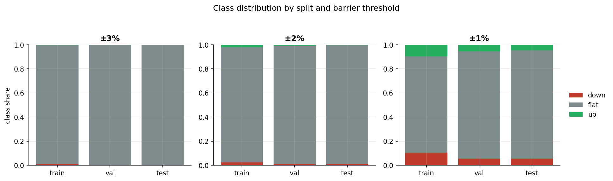
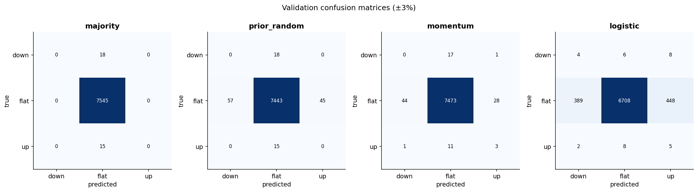
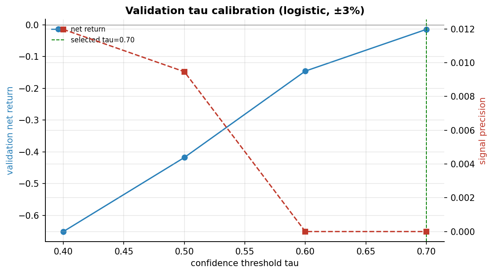
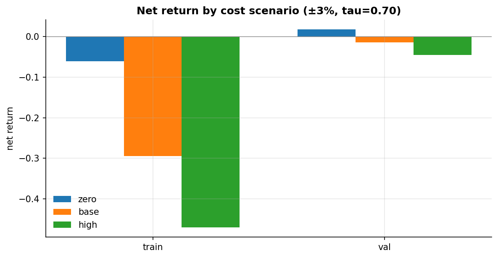

<!-- Render with: marp reports/SLIDES.md -o slides.pdf  (or VS Code Marp extension) -->

# Hourly Extreme-Movement Prediction & Trading Validation on BTC

### APS1052 — Final Project

**Can interpretable hourly features predict which ±barrier BTC hits first in the
next hour — and is that tradeable after costs?**

Frozen dataset · logistic main model · barrier-aligned backtest · full statistical validation

---

## 1. Motivation

- Hourly ±3% BTC moves are rare but consequential (liquidation cascades, news).
- Predicting *which side breaks first* is directly actionable (TP/SL = barrier).
- The interesting question is not just accuracy — it is whether any predictive
  edge survives **transaction costs** and **data-snooping correction**.

---

## 2. Research question

> Can interpretable market, sentiment, and leverage features observed at hourly
> decision points predict which price barrier will be reached first in the
> following hour, and generate statistically and economically meaningful trading
> performance after transaction costs?

Chain: **Data → Supervised learning → Signals → Backtest → Statistical validation.**

---

## 3. Data sources

- Binance spot 1-minute klines → hourly bars + intra-hour first-touch path
- Futures open interest (5-min), funding rate (8-h) — as-of merged, no look-ahead
- **50,522 hourly observations**, 2020-09 → 2026-06, **0 missing**

---

## 4. Existing hourly data architecture

- Decision timestamp = the hour; forward window (t, t+1h] judged on 1-min bars
- 10 interpretable features (all data ≤ t)
- First-touch triple-barrier label {−1, 0, +1}
- Dataset **frozen** — the project validates, it does not re-engineer data

---

## 5. Why hourly decision points

- 1-minute bars give path resolution; hourly timestamps give **non-overlapping**
  forward windows
- 5-minute decisions would share ~59/60 of each window → inflated metrics, leaked
  boundaries, exaggerated event counts
- Clean statistical unit of analysis

---

## 6. First-touch label

$$y_t=\begin{cases}+1 & \text{upper } (1+\theta) \text{ touched first}\\-1 & \text{lower } (1-\theta) \text{ touched first}\\0 & \text{neither}\end{cases}$$

Encodes **direction + magnitude + path ordering + fixed horizon**.
Main θ = 3%; θ ∈ {1%, 2%} pre-registered sensitivity.

---

## 7. Feature set (10, five dimensions)

| dimension | features |
|---|---|
| price / trend | ret_1h, ret_24h, close_vs_sma24 |
| volatility | rvol_24h, range_24h |
| volume | vol_ratio_24h |
| sentiment / flow | rsi_14, taker_buy_frac_1h |
| leverage | oi_chg_4h, funding_rate |

Each explainable in one sentence; no indicator bloat.

---

## 8. Leakage prevention

- Rolling windows look backward only
- Funding / OI use real release times (backward as-of merge, bounded tolerance)
- Scalers fit on **train only**
- Chronological split, never shuffled
- **Audit: 0 missing, 0 label violations, 99.39% timestamp coverage**

---

## 9. Class distribution — extreme imbalance

±3%: flat ≈ 98.9% overall; validation/test have only 33 / 21 extreme events.

---

## 10. Time split

| split | n | period | −1 / +1 (±3%) |
|---|---|---|---|
| train | 35,365 | 2020-09 → 2024-09 | 309 / 203 |
| validation | 7,578 | → 2025-08 | 18 / 15 |
| test | 7,579 | → 2026-06 | 14 / 7 |

Test sealed until the single final evaluation.

---

## 11. EDA — the central challenge is non-stationarity

Extreme events cluster in 2021 (≤10.75%/month) and vanish by 2025. Train on high
volatility, predict on low.

---

## 12. EDA — features are complementary, not redundant

Max |corr| 0.882, max VIF 6.58 — moderate, within-dimension; no feature dropped.
Volatility features carry the most mutual information.

---

## 13. Baselines

| model | balanced acc | extreme PR-AUC |
|---|---|---|
| majority | 0.333 | 0.004 |
| prior-random | 0.329 | 0.004 |
| momentum rule | 0.397 | — |
| logistic | 0.482 | **0.104** |

Logistic PR-AUC ≈ **23× the random prior** → the features carry signal.

---

## 14. Models — six learners

Multinomial logistic · Random Forest · XGBoost · LightGBM · MLP · LSTM
(class-balanced; scalers/seeds fixed; early stopping for NNs).

---

## 15. Classification metrics — the simplest model wins

| model | PR-AUC | balanced acc | extreme recall |
|---|---|---|---|
| **logistic** | **0.104** | 0.482 | 0.58 |
| mlp | 0.045 | 0.494 | 0.64 |
| rf / xgb / lgbm | 0.028–0.037 | ~0.33 | 0–0.09 |
| lstm | 0.026 | 0.457 | 0.52 |

Trees overfit the 2021 regime; low log loss is misleading (they predict flat).

---

## 16. Confusion matrix (validation, ±3%)

Balanced weights → high extreme recall, very low precision (many false alarms).

---

## 17. Extreme-event evaluation & calibration

All models **over-confident** (class balancing): predicted extreme prob → 0.7,
observed ≈ 0.02. τ must be an empirical operating point, not a probability.

---

## 18. Signal construction

- `+1` if P(+1) ≥ τ, `−1` if P(−1) ≥ τ, else flat
- τ swept on validation trading performance → **frozen τ = 0.70** (±3%)
- Fixed position size; at most one position per hour

---

## 19. Backtest rules (barrier-aligned)

- Enter at **next-minute open** after the hourly signal
- TP = SL = barrier; max hold 1 hour; first-touch on 1-min path
- Path table reproduces stored labels with **100% agreement**
- Prediction target = execution rule (aligned)

---

## 20. Transaction costs

Binance USDT-M perpetual, per side (fee + slippage):

| scenario | per side | round trip |
|---|---|---|
| zero | 0.00% | 0.00% |
| **base** | **0.05%** | **0.10%** |
| high | 0.10% | 0.20% |

---

## 21. Train / validation equity (±3%)

Gross edge exists; base cost turns it negative. Strategy is low-frequency and
near-flat vs buy-and-hold.

---

## 22. Financial metrics — validation ±3% (base)

| metric | value |
|---|---|
| trades | 32 |
| gross return | +1.79% |
| **net return** | **−1.41%** |
| Sharpe | −0.37 |
| profit factor (gross) | 1.25 |

Small real edge, erased by ~3.2% cumulative cost over 32 round trips.

---

## 23. Cost sensitivity

Zero → base → high: the sign of net return flips with realistic frictions.
The result is entirely explained by cost, not a code bug.

---

## 24. Permutation test (validation, ±3%)

Circular-shift permutation p = **0.232** (net & gross). Trade-level bootstrap net
CI **[−8.4%, +6.7%]** includes zero. 32 trades → wide by design.

---

## 25. Barrier sensitivity (pre-registered)

| barrier | PR-AUC | net | perm p | RC p |
|---|---|---|---|---|
| ±3% | 0.104 | −1.41% | 0.232 | 1.000 |
| ±2% | 0.115 | **+2.36%** | **0.015** | 0.919 |
| ±1% | **0.367** | −2.93% | 0.114 | 0.979 |

---

## 26. White's Reality Check — why it matters

- ±2% looks significant on a single permutation test (p = 0.015)…
- …but over **6 models × 4 τ** candidates, White's Reality Check p = **0.92**
- The best strategy does **not** beat always-flat once the search is corrected
- No barrier is data-snooping-robust

---

## 27. Final out-of-sample test

| barrier | trades | gross | net | net 95% CI | Sharpe | perm p |
|---|---|---|---|---|---|---|
| ±3% | 46 | +7.6% | +2.73% | [−9.7%, +17.1%] | +0.47 | 0.017 |
| ±1% | 80 | +15.4% | +6.49% | [−5.3%, +19.7%] | +1.18 | 0.0005 |

Net-positive OOS; test window was a BTC drawdown (buy&hold −45%). But CIs include zero.

---

## 28. Robustness & interpretation

- **Long vs short**: signals are short-biased; positive during the test bear market
- **Regime**: extreme events concentrated in 2021; sparse thereafter
- **Time stability**: results driven by few events → wide intervals
- Logistic coefficients: volatility/leverage raise extreme probability

---

## 29. Limitations

1. Tiny tail sample (21–105 extreme test events at ±2%/±3%)
2. Strong regime shift (train high-vol, test low-vol)
3. Probability miscalibration from class balancing
4. Real data-snooping search → reality check not rejected
5. Single asset / venue; costs are assumptions

---

## 30. Conclusion

- **Weak, genuine predictive signal**: PR-AUC ≫ prior; OOS permutation
  significant at ±1% and ±3%.
- **Not tradeable economic value**: net-return CIs include zero at every barrier;
  White's Reality Check not rejected.
- **The contribution**: cleanly separating *statistical predictability* from
  *economic realizability*, with every setting frozen and no result-driven tuning.

> Predictability ≠ profitability. A rigorous negative-leaning result.
